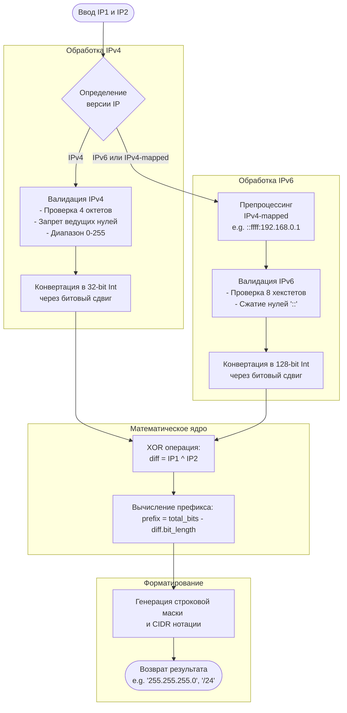

# IP Mask Calculator

Алгоритм поиска минимальной маски (Smallest Covering CIDR) между двумя произвольными IP-адресами. 
Реализован на чистом Python без использования сторонних библиотек (включая `ipaddress`), с поддержкой IPv4, IPv6 и IPv4-mapped IPv6 адресов.

## Схема работы алгоритма



## Теоретическая база и выдержки из стандартов (RFC)

### 1. Суть задачи: Что такое "Минимальная маска"?
В сетях маршрутизаторы используют маски подсетей (CIDR — Classless Inter-Domain Routing), чтобы понимать, какие IP-адреса находятся в одной локальной сети, а какие — за её пределами. 

Задача поиска минимальной маски между двумя произвольными IP-адресами сводится к поиску **наименьшей общей подсети**, которая включает в себя оба этих адреса. 

Например, для адресов `192.168.1.10` и `192.168.1.20`:
- Подсеть `/32` (только один адрес) их не покроет.
- Подсеть `/24` (от `.0` до `.255`) их покроет, но она слишком большая.
- Минимальная подсеть, которая вместит оба адреса — это `/27`. Она охватывает диапазон от `192.168.1.0` до `192.168.1.31` (32 адреса).

**Математический смысл:** Маска подсети — это количество совпадающих старших (левых) битов у двух IP-адресов. Как только биты начинают различаться, общая сеть заканчивается.

> **RFC 4632 (CIDR), Section 3.1:**
> *"The prefix length specifies the number of the leftmost contiguous significant bits of the address that form the routing prefix."*
> (Длина префикса указывает количество крайних левых непрерывных значащих битов адреса, которые образуют префикс маршрутизации).

### 2. Побитовые операции: Магия XOR (`^`)
Вместо того чтобы сравнивать адреса посимвольно или математически делить их, алгоритм использует побитовые операции. Это работает мгновенно на уровне процессора.

**Операция XOR (Исключающее ИЛИ):**
Возвращает `0`, если биты одинаковые, и `1`, если биты разные.

1. Переводим оба IP-адреса в целые числа (32 бита для IPv4, 128 бит для IPv6).
2. Делаем `diff = IP1 ^ IP2`.
3. В результате `diff` все совпадающие левые биты станут нулями. Первая же встретившаяся `1` (слева направо) покажет место, где адреса начали различаться.
4. В Python мы узнаем длину получившегося числа с помощью метода `.bit_length()`. Это дает нам количество бит, которые различаются.
5. Длина префикса (CIDR) вычисляется просто: `Общая_длина_адреса - diff.bit_length()`.

### 3. Анатомия IP-адресов и их ручной парсинг

Так как использование библиотеки `ipaddress` запрещено, реализована строгая валидация по стандартам RFC.

#### Архитектура IPv4 (RFC 791)
Оригинальный стандарт интернета (Internet Protocol), принятый в сентябре 1981 года.
* **Структура:** 32 бита, разделенные на 4 октета (по 8 бит).
* **Научное обоснование (RFC 791, Section 2.3):**
  > *"Addresses are fixed length of four octets (32 bits). An address begins with a network number, followed by local address (called the "rest" field)."*
  > (Адреса имеют фиксированную длину в четыре октета (32 бита). Адрес начинается с номера сети, за которым следует локальный адрес (называемый полем «остаток»)).
* **Правила валидации для парсера:**
  1. Ровно 4 октета.
  2. Каждый октет — это число от `0` до `255`.
  3. **Запрет ведущих нулей:** Адрес `192.168.01.1` является невалидным. Согласно стандартам парсинга (и документации Python `ipaddress`), ведущие нули могут быть восприняты как восьмеричная система счисления, что приводит к уязвимостям.

> **Из документации Python (`ipaddress`):**
> *"At this time, the behavior of the IP address modules is to strictly reject any IPv4 address string that contains leading zeros. The reason for this is that some parsers (e.g. inet_aton) treat leading zeros as indicating an octal value..."*

#### Архитектура IPv6 (RFC 4291)
Современная архитектура адресации, призванная решить проблему нехватки IPv4-адресов.
* **Структура:** 128 бит, разделенные на 8 групп (хекстетов) по 16 бит. Записываются в шестнадцатеричном виде через двоеточие.
* **Научное обоснование модели (RFC 4291, Section 2.1):**
  > *"IPv6 addresses of all types are assigned to interfaces, not nodes. An IPv6 unicast address refers to a single interface. Since each interface belongs to a single node, any of that node's interfaces' unicast addresses may be used as an identifier for the node."*
  > (IPv6-адреса всех типов назначаются интерфейсам, а не узлам. Одноадресный IPv6-адрес относится к одному интерфейсу. Поскольку каждый интерфейс принадлежит одному узлу, любой из одноадресных адресов интерфейсов этого узла может использоваться в качестве идентификатора для этого узла.)
* **Правила сжатия (Zero Compression):** Последовательность нулевых групп можно заменить на `::`. 

> **RFC 4291, Section 2.2:**
> *"The use of '::' indicates one or more groups of 16 bits of zeros. The '::' can only appear once in an address."*
> Наш парсер строго проверяет это правило и выбрасывает ошибку, если `::` встречается более одного раза.

#### Смешанный формат: IPv4-mapped IPv6 (RFC 4291, Section 2.5.5.2)
Механизм обратной совместимости, позволяющий узлам IPv6 работать с IPv4.
* **Структура:** Первые 80 бит — нули, следующие 16 бит — единицы (`ffff`), последние 32 бита — стандартный IPv4 адрес.
* **Научное обоснование (RFC 4291, Section 2.5.5.2):**
  > *"A second type of IPv6 address which holds an embedded IPv4 address is defined. This address type is used to represent the addresses of IPv4 nodes as IPv6 addresses."*
  > (Определен второй тип IPv6-адреса, который содержит встроенный IPv4-адрес. Этот тип адреса используется для представления адресов IPv4-узлов в виде IPv6-адресов.)
* **Пример:** `::ffff:192.168.1.1`
* **Парсинг:** Если в IPv6 адресе есть точка `.`, алгоритм отрезает IPv4-часть, прогоняет через IPv4-парсер, разбивает на два 16-битных шестнадцатеричных блока и склеивает обратно в строку IPv6 для дальнейшей обработки.

### 4. Форматирование результата (Строковая маска)
Алгоритм возвращает CIDR (например, `/24`) и строковую маску (`255.255.255.0`).

**Генерация маски из префикса:**
Для IPv4 (префикс 24) нужно создать 32-битное число, где первые 24 бита — единицы, а остальные 8 — нули.
Используется битовый сдвиг: `mask_int = ((1 << prefix) - 1) << (32 - prefix)`. Затем число нарезается обратно на октеты или хекстеты.

### 5. Разница между IPv4 и IPv6 в контексте маршрутизации и почему XOR-метод оптимален

При проектировании алгоритма важно понимать фундаментальные различия между IPv4 и IPv6, так как они напрямую влияют на выбор математического аппарата.

#### Различия архитектур
1. **Размер адресного пространства:**
   * **IPv4** использует 32-битные адреса, что дает около 4.3 миллиарда уникальных адресов.
   * **IPv6** использует 128-битные адреса, предоставляя $2^{128}$ (около $3.4 \times 10^{38}$) адресов.
2. **Иерархия маршрутизации:**
   * В IPv4 маски подсетей часто фрагментированы из-за исторической нехватки адресов (NAT, мелкие подсети `/29`, `/30`).
   * В IPv6 маршрутизация строго иерархична. Провайдеры выдают клиентам огромные блоки (обычно `/48` или `/56`), а внутри локальных сетей почти всегда используется префикс `/64`.
3. **Представление в памяти:**
   * IPv4 легко помещается в стандартный 32-битный регистр процессора (Integer).
   * IPv6 требует 128 бит. В языках со строгой типизацией (C, Java) для этого требуются структуры из двух 64-битных чисел или массивы байтов. В Python тип `int` имеет произвольную точность, что позволяет нам работать со 128-битными числами так же легко, как и с 32-битными.

#### Почему побитовый XOR (`^`) — лучший метод?

Существует несколько способов найти общую подсеть (минимальную маску) между двумя адресами. Рассмотрим их и поймем, почему выбранный нами метод XOR идеален.

**Альтернатива 1: Посимвольное сравнение строк**
* *Как работает:* Идем по строкам `192.168.1.10` и `192.168.1.20` слева направо и ищем, где символы расходятся.
* *Почему это плохо:* IP-адреса — это не строки, это числа. Адреса `192.168.1.10` и `192.168.1.20` совпадают до символа `1.`, но математически их общая маска — `/27`, которая разрезает последний октет пополам (на уровне битов). Строковое сравнение не может работать с битовыми границами. В IPv6 из-за сжатия нулей (`::`) строковое сравнение вообще теряет смысл.

**Альтернатива 2: Итеративный битовый сдвиг (Цикл)**
* *Как работает:* Переводим адреса в числа. В цикле `while` сдвигаем оба числа вправо на 1 бит (`>> 1`), пока они не станут равны. Количество шагов цикла — это количество различающихся бит.
* *Почему это хуже:* Для IPv6 в худшем случае (когда адреса различаются в самом первом бите) цикл выполнится 128 раз. Это операция за линейное время $O(N)$, где $N$ — длина адреса в битах.

**Наш метод: Побитовый XOR (`IP1 ^ IP2`) + `bit_length()`**
* *Как работает:* 
  1. `diff = IP1 ^ IP2` (выполняется за 1 такт процессора).
  2. `diff.bit_length()` (находит старший ненулевой бит, обычно реализуется через аппаратную инструкцию процессора, например `BSR` — Bit Scan Reverse, или `CLZ` — Count Leading Zeros).
* *Почему это идеально:*
  1. **Скорость $O(1)$:** Операция выполняется за константное время, независимо от того, IPv4 это (32 бита) или IPv6 (128 бит). Нет никаких циклов.
  2. **Универсальность:** Математика абсолютно идентична для обеих версий IP. Разница лишь в константе общей длины (32 или 128), из которой вычитается `bit_length()`.
  3. **Элегантность:** Код получается максимально коротким и защищенным от логических ошибок (off-by-one errors), которые часто возникают при написании ручных циклов.

> **Вывод для собеседования:**
> Использование XOR демонстрирует глубокое понимание того, как данные хранятся в памяти компьютера. Вместо того чтобы бороться с абстракциями высокого уровня (строками или массивами), алгоритм спускается на уровень регистров процессора, где задача поиска расхождения в битах решается одной нативной инструкцией.

## Использование

```python
from ip_mask_calculator import get_minimum_mask

# Пример 1: Обычные IPv4 адреса
result = get_minimum_mask('192.168.1.10', '192.168.1.20')
print(result)
# {'cidr': '/27', 'mask': '255.255.255.224'}

# Пример 2: IPv6 адреса
result_v6 = get_minimum_mask('2001:db8::1', '2001:db8::2')
print(result_v6)
# {'cidr': '/126', 'mask': 'ffff:ffff:ffff:ffff:ffff:ffff:ffff:fffc'}

# Пример 3: IPv4-mapped IPv6 адреса
result_mapped = get_minimum_mask('::ffff:10.0.0.1', '::ffff:10.255.255.254')
print(result_mapped)
# {'cidr': '/104', 'mask': 'ffff:ffff:ffff:ffff:ffff:ffff:ff00:0'}
```